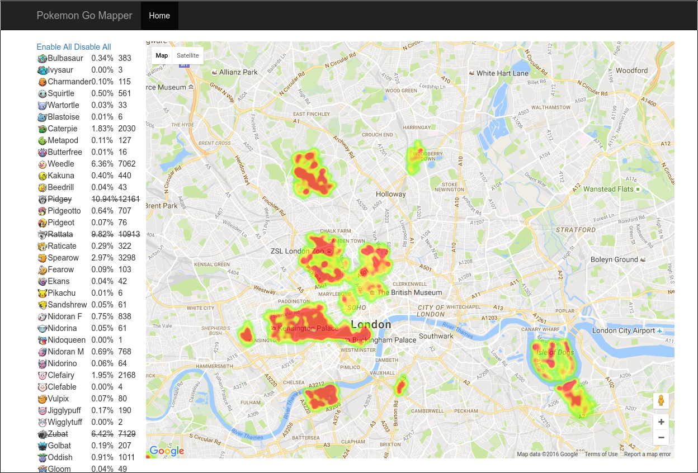

# PokeMapper

This app consists of two parts:
- a scanner to collect data about Pokemon spawns, scanner.py. 
  This uses the excellent API from [pgoapi](https://github.com/tejado/pgoapi).
- a visualization of collected data, map.py. This uses flask and the Google Maps
  API.

Both can be run indepently, and to get started I've included a sample snapshot
of data collected in London over two days.

## Screeshot

